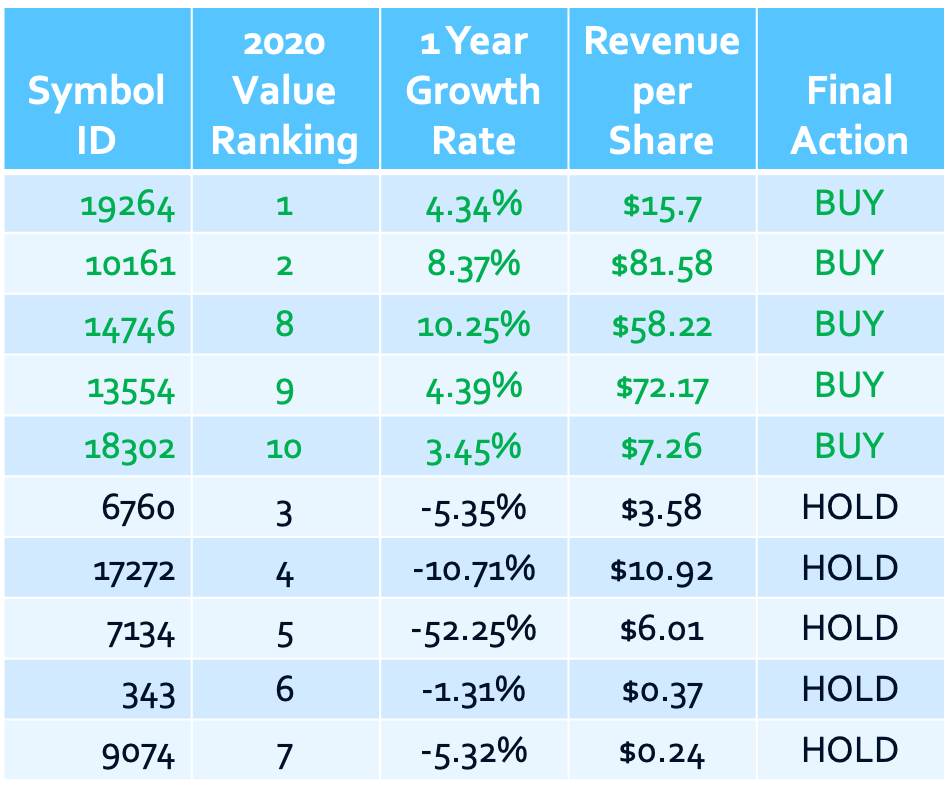

# Modeling Micro-Cap Stock Growth

# Overview

HIT Investments is looking to leverage advanced analytics to aid in their decision-making process of identifying high-value, low cost stocks to invest in for their clients. Their specialty is finding and investing in micro-cap stocks which have been undervalued by others but otherwise show strong financial metrics. 

Historically, HIT Investments has leveraged their expertise to determine a Value Ranking of these stocks which takes into account multiple financial performance metrics. This analysis will take the next step and investigate how the top value stocks are projected to grow into the future to help further aid in their decision to buy a stock. 

# Business Problem

HIT Investments strives to maximize after-tax returns for their clients by actively identifying and capitalizing on proven inefficiencies in the stock market using quantitative analysis. 

A market is said to be "efficient" if the price of a stock reflects all available and relevant information. This theory holds true for larger companies that are thoroughly tracked by investment firms. However, HIT Investments believes the market has inefficiencies, specifically in the Micro-Cap segment, which can be exploited to outpeform the stock market and deliver maximum return on investment. Micro-Cap stocks encompass more than one-half of the nationally traded companies so there are many opportunities to examine these stocks for value and growth potential. 

# Data

This analysis will investigate stocks from the [FMP](https://financialmodelingprep.com/) API, rank the stocks based on HIT Investments' "value" metrics and then forecast future growth of the top value stocks. This will provide HIT Investments with a new "growth" metric to utilize alongside the "value" metric to further quantify which stocks may be inefficient and therefore provide value to an investor.

# Methods

This analysis will examine stocks based on 5 key performance metrics that define its' "value":


The stocks will then be ranked comparitively based on these value metrics. For the top "value" stocks, the historical performance on reveneue per share (`revenue_per_share`) will be analyzed and modeled to forecast future growth. This will produce a second ranking of stocks based soley on growth. Lastly, the "Value" and "Growth" rankings will be consolidated in order to 

To simplify the analysis, I will perform the value rankings first and will delete the `date` feature in order to remove duplicate values for the `symbol_id`. Once the top "value" stocks are identified, I will bring the `date` feature back in to model and forecast the `revenue_per_share`. 


# Results

After modeling was complete for each of the top 10 value stocks, I summarized the percentage growth between the end of the timeseries data and the end of the foreacst:



The table shows 2 main points:
1. The addition of the predicted future growth has changed the view of which stocks are valuable to invest in as there are stocks with high value and both high and low growth potential
2. The granularity of the ranking is not sufficient when only modeling 10 stocks. This is shown by duplicate rankings in the Total Ranking column. As more stocks are modeled, the rankings will become more unique. 

# Conclusions

In conclusion, utilzing time series modeling to investigate the growth of high value stocks to gain additional insight on its overall performance has shown to be helpful in truly understanding which stocks could be a good addition to an investment portfolio. 

Now that HIT Investments has another meaningful way to analyze stock performance (value and now growth), it is recommended to persue stocks which both rank high for value and have a positive growth rate. Given more time, more stocks should be modeled in order to give a better view of high value stocks which show great future growth potential.

## **For More Information**

Please review our full analysis in the [Jupyter Notebook](https://github.com/bentson1187/dsc-phase-4-project/blob/d9d40270d95b9eeda292bc68549196ff47d3e97f/Phase_4_Project.ipynb) or [presentation](https://github.com/bentson1187/dsc-phase-4-project/blob/d9d40270d95b9eeda292bc68549196ff47d3e97f/Stakeholder%20Presentation.pptx). 

For any additional questions, please contact **Brian Bentson, bentson.brian@gmail.com**

## Repository Structure

Describe the structure of your repository and its contents, for example:

```
├── README.md                           <- The top-level README for reviewers of this project
├── Phase 4 Project.ipynb       <- Narrative documentation of analysis in Jupyter notebook
├── Stakeholder Presentation.ppt        <- Project presentation
└── Images                              <- Both sourced externally and generated from code
```
